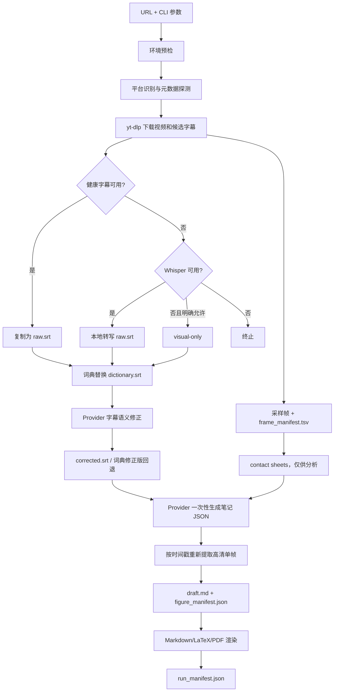

# 流水线数据流

## 主流程

## 输入与中间产物

| 阶段 | 主要输入 | 主要输出 |
|---|---|---|
| 探测 | 原始 URL、cookies 选项 | 平台、ID、时长、canonical URL、字幕语言 |
| 下载 | canonical URL | `source/video.*`、字幕、info JSON |
| 转写 | 视频或健康字幕 | `raw.srt` |
| 词典 | `raw.srt`、上下文、领域 | `dictionary.srt`、领域列表 |
| 证据 | 视频、时长 | `evidence/frames/`、`frame_manifest.tsv`、contact sheets |
| 修正 | 字典字幕、帧、Provider | `corrected.srt`、`glossary_update.json` |
| 笔记 | 修正字幕、contact sheets | `notes_payload.json`、`draft.md`、`figures/` |
| 渲染 | draft、时长、源信号 | `notes.md`、可选 `notes.tex`/`notes.pdf`、manifest |

## 数据约束

- URL 写入状态前移除 query、fragment 和 userinfo，避免泄露分享 token 或凭据。
- contact sheet 不允许进入最终 Markdown；最终图片必须匹配
  `figures/figure_NNN.jpg` 并出现在 `figure_manifest.json`。
- LLM 只能声明源视频存在的 `formula`、`code`、`table`、`figure` 信号。
- 词典候选必须同时引用原字幕、修正字幕和 SRT index。
- Provider 最终笔记结构无效时终止，不用重复字幕伪造笔记。

完整失败与恢复行为见[状态与失败流程](state-and-failure-flow.md)。
