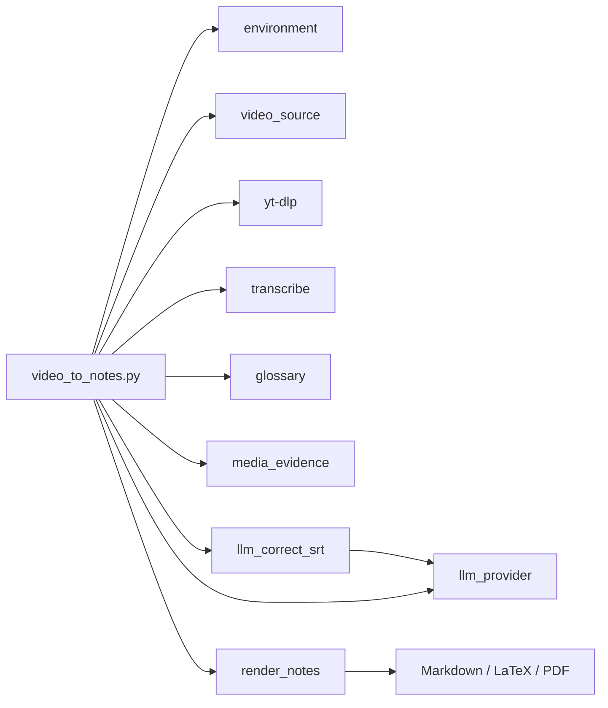

# 系统架构

## 修改前

原项目以课程型 Skill 和多个手工脚本为主，字幕提示词绑定 `nju_os.txt`，中间产物需要人工
传递，输出偏向 LaTeX/PDF。视频源、Provider、词典、转写和渲染没有统一运行状态。

## 当前结构

`video_to_notes.py` 只负责编排，领域逻辑保留在独立模块。各模块也可单独通过 CLI 使用。

## 模块边界

| 模块 | 主要责任 | 不负责 |
|---|---|---|
| `environment` | 依赖检查、安装计划、工具覆盖 | 执行业务流水线 |
| `video_source` | URL 分类、安全短链解析、元数据探测 | 保存 Cookie、下载产物管理 |
| `llm_provider` | Provider 调用和结构校验 | 自动切换 Provider |
| `transcribe` | 音视频转 SRT | 字幕语义修正 |
| `glossary` | 词典选择、读取和证据化更新 | 无证据学习 |
| `media_evidence` | 分析帧、contact sheet、最终单帧 | 决定笔记内容 |
| `render_notes` | 输出验证和格式转换 | 生成正文语义 |
| `video_to_notes` | 阶段编排、状态、恢复和失败策略 | 隐藏必需依赖错误 |

## 公开接口与兼容性

Provider 统一实现 `correct(prompt, image, schema)` 和
`generate(prompt, images, schema)`。当前实现为 `KimiCLIProvider` 与 `OpenAIProvider`。

`skills/video-to-notes/` 是当前入口；`skills/lecture-to-notes/` 保留兼容引用。既有独立脚本
仍可运行，主流程只在其上增加统一编排，不要求迁移已有媒体或词典。

## 外部边界

- 网络：视频平台、Kimi CLI 或 OpenAI 兼容服务。
- 本地命令：yt-dlp、FFmpeg/ffprobe、可选 Pandoc/XeLaTeX。
- 用户数据：浏览器 Cookie 只透传给 yt-dlp；API key 只来自环境；用户词典在 home 目录。
- 仓库输出：所有运行产物写入 `runs/`、指定 `--output-dir` 或用户词典目录。
